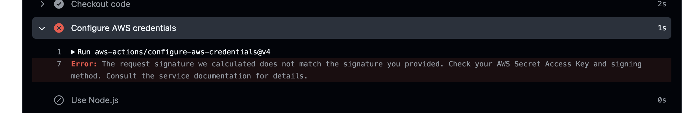

# cdk-template

🏸🏸🏸 Amazon SNSを使ってみる！  

  

## 実行方法

`.env.example`をコピーして`.env`ファイルを作成します。  
中身を適切に設定してください。  

DevContainerに入り、以下のコマンドを実行します。  
※ `~/.aws/credentials`にAWSの認証情報があることを前提とします。  

```shell
cdk bootstrap
cdk synth
cdk deploy --require-approval never --all
```

リソースのプロビジョニング後に、サブスクリプションの確認を行う必要があります。  
`.env`ファイルで指定した、`SNS_SUBSCRIPTION_URL (SubscribeURLプロパティ)`と`SNS_SUBSCRIPTION_EMAIL (Confirm subscriptionリンク)`にそれぞれ確認用のリンクが設定されています。  
リンクを開くと、サブスクリプションの確認が完了します。  

確認が完了したら、`publish.sh`を実行してメッセージを送信します。  

```shell
./publish.sh
```

EメールとHTTPエンドポイントにメッセージが送信されます。  

---

GitHub Actionsでデプロイするためには、以下のシークレットを設定してください。  

| シークレット名 | 説明 |
| --- | --- |
| AWS_ACCESS_KEY_ID | AWSのアクセスキーID |
| AWS_SECRET_ACCESS_KEY | AWSのシークレットアクセスキー |
| AWS_REGION | AWSのリージョン |
| DOTENV | `.env`ファイルの内容 |

タグをプッシュすると、GitHub Actionsがデプロイを行います。  
手動でトリガーすることも可能です。  

## 余談

GitHub Actionsでのデプロイ時に、以下のエラーが発生しました。  

```error
Error: The request signature we calculated does not match the signature you provided. Check your AWS Secret Access Key and signing method. Consult the service documentation for details.
```

  

このエラーは、AWSのアクセスキーIDとシークレットアクセスキーに特殊文字が含まれていることが原因です。  

```text
Possible cause: Your operating system is mishandling AWS keys that contain certain special characters
  If your AWS keys include certain special characters, such as -, +, /, or %, some operating system variants process the string improperly and cause the key string to be interpreted incorrectly.
  If you process your keys using other tools or scripts, such as tools that build the credentials file on a new instance as part of its creation, those tools and scripts might have their own handling of special characters that causes them to be transformed into something that AWS no longer recognizes.
  We suggest regenerating the secret key to get one that does not include the special character causing issues.
```
Ref: <https://docs.aws.amazon.com/cli/latest/userguide/cli-chap-troubleshooting.html#tshoot-signature-does-not-match>  

このエラーを解消するために、特殊文字が含まれないシークレットアクセスキーになるまで、AWSのアクセスキーIDとシークレットアクセスキーを再生成しました。  
<https://github.com/aws/aws-cli/issues/602>でも議論されていますね、、、  
う〜〜〜ん、、、泣  
